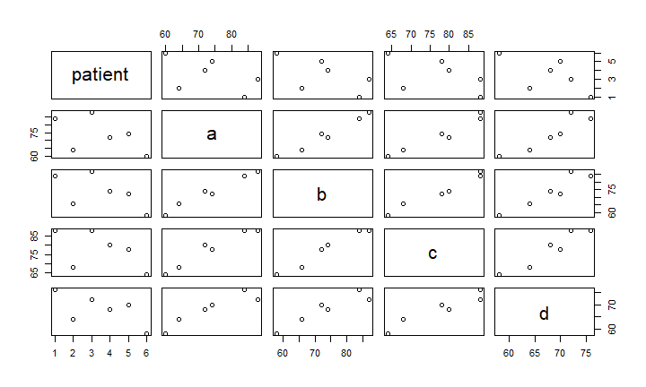
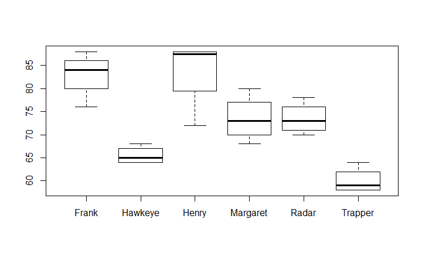

## Setup (beginning of class)
- Please download `class_files` from [GitHub](https://github.com/FRS417-DataScienceBiologists)
- Please open your homework in RStudio
- Open a browser window to your GitHub repository
- Check in right working directory 'getwd()'


## Tidyverse
- A collection of packages designed to work together for data analysis
- Consistent, intuitive, and much easier to use


```
## -- Attaching packages ------- tidyverse 1.2.1 --
```

```
## v ggplot2 3.1.0     v purrr   0.2.5
## v tibble  1.4.2     v dplyr   0.7.8
## v tidyr   0.8.2     v stringr 1.3.1
## v readr   1.3.1     v forcats 0.3.0
```

```
## -- Conflicts ---------- tidyverse_conflicts() --
## x dplyr::filter() masks stats::filter()
## x dplyr::lag()    masks stats::lag()
```


## Overview for Today's Lab
1. Review any homework questions.
      - what does glimpse give that names doesn't? gives dimensions, and esp class of data (int, num, etc.)
      - to pick things, 'subset()' base R code, not tidyverse; easier to use 'select()'
      - 'mean(__$__)' base R code but it's helpful to find average
      - 'arrrange()' vs. 'order()': arrange by alphabetical, using order lets you order way you want 
2. Learn and practice dplyr.
3. Learn and practice tidyr.
    - tidy data
    - less conceptually intuitive

### Lab 3-1 Review

## Review filter() and select()

Load the fish scale data
Here we load a .csv file with data on fish scales. We open the file using `read_csv()`. 


Review what's actually in the df

```
## Observations: 4,033
## Variables: 6
## $ lakeid          <chr> "AL", "AL", "AL", "AL", "AL", "AL", "AL", "AL"...
## $ fish_id         <dbl> 299, 299, 299, 300, 300, 300, 300, 301, 301, 3...
## $ annnumber       <chr> "EDGE", "2", "1", "EDGE", "3", "2", "1", "EDGE...
## $ length          <dbl> 167, 167, 167, 175, 175, 175, 175, 194, 194, 1...
## $ radii_length_mm <dbl> 2.697443, 2.037518, 1.311795, 3.015477, 2.6707...
## $ scalelength     <dbl> 2.697443, 2.697443, 2.697443, 3.015477, 3.0154...
```
> Note: filter allows you to think in rows, can take rows out of df that correspond to variables of interest

Check col names so you're calling the right variables of interest

```
## [1] "lakeid"          "fish_id"         "annnumber"       "length"         
## [5] "radii_length_mm" "scalelength"
```

# filter()
use pipes, can combine mult filters to further refine df

```
## # A tibble: 3 x 6
##   lakeid fish_id annnumber length radii_length_mm scalelength
##   <chr>    <dbl> <chr>      <dbl>           <dbl>       <dbl>
## 1 AL         299 EDGE         167            2.70        2.70
## 2 AL         299 2            167            2.04        2.70
## 3 AL         299 1            167            1.31        2.70
```

# select()
Select allows you to build a new data frame by selecting your columns (variables) of interest. Our fish data only has six columns, but this should give you some ideas especially when you have large data frames with lots of columns.  

We are only interested in lakeid and scalelength.

```
## # A tibble: 4,033 x 2
##    lakeid scalelength
##    <chr>        <dbl>
##  1 AL            2.70
##  2 AL            2.70
##  3 AL            2.70
##  4 AL            3.02
##  5 AL            3.02
##  6 AL            3.02
##  7 AL            3.02
##  8 AL            3.34
##  9 AL            3.34
## 10 AL            3.34
## # ... with 4,023 more rows
```

The `-` operator is useful in select. It allows us to select everything except the specified variables.

```
## # A tibble: 4,033 x 2
##    lakeid scalelength
##    <chr>        <dbl>
##  1 AL            2.70
##  2 AL            2.70
##  3 AL            2.70
##  4 AL            3.02
##  5 AL            3.02
##  6 AL            3.02
##  7 AL            3.02
##  8 AL            3.34
##  9 AL            3.34
## 10 AL            3.34
## # ... with 4,023 more rows
```

For very large data frames with lots of variables, `select()` uses many different operators to make things easier. Let's say we are only interested in the variables that deal with length.

```
## # A tibble: 4,033 x 3
##    length radii_length_mm scalelength
##     <dbl>           <dbl>       <dbl>
##  1    167            2.70        2.70
##  2    167            2.04        2.70
##  3    167            1.31        2.70
##  4    175            3.02        3.02
##  5    175            2.67        3.02
##  6    175            2.14        3.02
##  7    175            1.23        3.02
##  8    194            3.34        3.34
##  9    194            2.97        3.34
## 10    194            2.29        3.34
## # ... with 4,023 more rows
```


Some additional options to select columns based on a specific criteria include:  
1. ends_with() = Select columns that end with a character string  
2. contains() = Select columns that contain a character string  
3. matches() = Select columns that match a regular expression  
4. one_of() = Select columns names that are from a group of names  

>Note: filter() and select() can go in any order


## Practice: select()

1. What are the names of the columns in the `fish` data?

```
## [1] "lakeid"          "fish_id"         "annnumber"       "length"         
## [5] "radii_length_mm" "scalelength"
```

2. We are only interested in the variables `lakeid`, `length`, and `scalelength`. Use `select()` to build a new dataframe focused on these variables.


```
## # A tibble: 4,033 x 3
##    lakeid length scalelength
##    <chr>   <dbl>       <dbl>
##  1 AL        167        2.70
##  2 AL        167        2.70
##  3 AL        167        2.70
##  4 AL        175        3.02
##  5 AL        175        3.02
##  6 AL        175        3.02
##  7 AL        175        3.02
##  8 AL        194        3.34
##  9 AL        194        3.34
## 10 AL        194        3.34
## # ... with 4,023 more rows
```


## Dplyr: Can we combine filter() and select()?
Absolutely. This is one of the strengths of the tidyverse, it uses the same grammar to specify commands.


```
## # A tibble: 383 x 2
##    lakeid scalelength
##    <chr>        <dbl>
##  1 AL            2.70
##  2 AL            2.70
##  3 AL            2.70
##  4 AL            3.02
##  5 AL            3.02
##  6 AL            3.02
##  7 AL            3.02
##  8 AL            3.34
##  9 AL            3.34
## 10 AL            3.34
## # ... with 373 more rows
```

# Combine filter() and select() using a pipe
The code above works fine but there is a more efficient way. We need to learn pipes `%>%`. Pipes allow you to feed the output from one function to the input of another function. We are going to use pipes from here on to keep things cleaner. (command+shift+m)

```
## # A tibble: 383 x 2
##    lakeid scalelength
##    <chr>        <dbl>
##  1 AL            2.70
##  2 AL            2.70
##  3 AL            2.70
##  4 AL            3.02
##  5 AL            3.02
##  6 AL            3.02
##  7 AL            3.02
##  8 AL            3.34
##  9 AL            3.34
## 10 AL            3.34
## # ... with 373 more rows
```


# Practice
1. Build a dataframe focused on the lakes `AL` and `AR` and looking at radii length between 2 and 4 only. Use pipes!


```
## # A tibble: 69 x 2
##    lakeid scalelength
##    <chr>        <dbl>
##  1 AL            2.70
##  2 AL            2.70
##  3 AL            2.70
##  4 AL            3.02
##  5 AL            3.02
##  6 AL            3.02
##  7 AL            3.02
##  8 AL            3.34
##  9 AL            3.34
## 10 AL            3.34
## # ... with 59 more rows
```

## Other functions in dplyr
> Note: Make sure to do reality checks to see if filters are working (like if it's within certain numbers)

#arrange(): allows us to sort values in a column.
Arrange in desc order

```
## # A tibble: 4,033 x 6
##    lakeid fish_id annnumber length radii_length_mm scalelength
##    <chr>    <dbl> <chr>      <dbl>           <dbl>       <dbl>
##  1 WS         180 EDGE         403           11.0         11.0
##  2 WS         180 16           403           10.6         11.0
##  3 WS         180 15           403           10.3         11.0
##  4 WS         180 14           403            9.93        11.0
##  5 WS         180 13           403            9.56        11.0
##  6 WS         180 12           403            9.17        11.0
##  7 WS         180 11           403            8.62        11.0
##  8 WS         180 10           403            8.15        11.0
##  9 WS         180 9            403            7.49        11.0
## 10 WS         180 8            403            6.97        11.0
## # ... with 4,023 more rows
```

Can also arrange characters (will sort alphabetically)

```
## # A tibble: 4,033 x 6
##    lakeid fish_id annnumber length radii_length_mm scalelength
##    <chr>    <dbl> <chr>      <dbl>           <dbl>       <dbl>
##  1 AL         299 EDGE         167            2.70        2.70
##  2 AL         299 2            167            2.04        2.70
##  3 AL         299 1            167            1.31        2.70
##  4 AL         300 EDGE         175            3.02        3.02
##  5 AL         300 3            175            2.67        3.02
##  6 AL         300 2            175            2.14        3.02
##  7 AL         300 1            175            1.23        3.02
##  8 AL         301 EDGE         194            3.34        3.34
##  9 AL         301 3            194            2.97        3.34
## 10 AL         301 2            194            2.29        3.34
## # ... with 4,023 more rows
```

It can be very helpful in combination with the other functions.

```
## # A tibble: 383 x 4
##    lakeid length fish_id scalelength
##    <chr>   <dbl>   <dbl>       <dbl>
##  1 AL        167     299        2.70
##  2 AL        167     299        2.70
##  3 AL        167     299        2.70
##  4 AL        175     300        3.02
##  5 AL        175     300        3.02
##  6 AL        175     300        3.02
##  7 AL        175     300        3.02
##  8 AL        194     301        3.34
##  9 AL        194     301        3.34
## 10 AL        194     301        3.34
## # ... with 373 more rows
```

# Practice: arrange()
1. Build a dataframe focused on the scalelengths of `fish_id` 300 and 301. Use `arrange()` to sort from smallest to largest scalelength. Use pipes!

```
## # A tibble: 8 x 2
##   fish_id scalelength
##     <dbl>       <dbl>
## 1     300        3.02
## 2     300        3.02
## 3     300        3.02
## 4     300        3.02
## 5     301        3.34
## 6     301        3.34
## 7     301        3.34
## 8     301        3.34
```

#count(): Can get a sense of range

```
## # A tibble: 16 x 2
##    lakeid     n
##    <chr>  <int>
##  1 AL       383
##  2 AR       262
##  3 BO       197
##  4 BR       291
##  5 CR       343
##  6 DY       355
##  7 FD       302
##  8 JN       238
##  9 LC       173
## 10 LJ       181
## 11 LR       292
## 12 LSG      143
## 13 MN       293
## 14 RD       135
## 15 UB       191
## 16 WS       254
```

#mutate(): Can create new col in df
`mutate()` is used to add new columns to a data frame. When you use mutate() the original data used are preserved. We will briefly practice `mutate()` here and come back to it in more detail later.  

```
## # A tibble: 383 x 5
##    lakeid fish_id scalelength length scale_ratio
##    <chr>    <dbl>       <dbl>  <dbl>       <dbl>
##  1 AL         299        2.70    167        61.9
##  2 AL         299        2.70    167        61.9
##  3 AL         299        2.70    167        61.9
##  4 AL         300        3.02    175        58.0
##  5 AL         300        3.02    175        58.0
##  6 AL         300        3.02    175        58.0
##  7 AL         300        3.02    175        58.0
##  8 AL         301        3.34    194        58.0
##  9 AL         301        3.34    194        58.0
## 10 AL         301        3.34    194        58.0
## # ... with 373 more rows
```


```
## [1] "lakeid"          "fish_id"         "annnumber"       "length"         
## [5] "radii_length_mm" "scalelength"
```

## Practice
1. Add a new column to the fish data that is radii_length_mm divided by scalelength. Add another column that scales this number to a percentage.

```
## # A tibble: 4,033 x 4
##    radii_length_mm scalelength radii_length_ratio radii_length_ratio_per
##              <dbl>       <dbl>              <dbl>                  <dbl>
##  1            2.70        2.70              1                      100  
##  2            2.04        2.70              0.755                   75.5
##  3            1.31        2.70              0.486                   48.6
##  4            3.02        3.02              1                      100  
##  5            2.67        3.02              0.886                   88.6
##  6            2.14        3.02              0.709                   70.9
##  7            1.23        3.02              0.408                   40.8
##  8            3.34        3.34              1                      100  
##  9            2.97        3.34              0.888                   88.8
## 10            2.29        3.34              0.686                   68.6
## # ... with 4,023 more rows
```


### Lab 3-2

> **For Big-Data Scientists, ‘Janitor Work’ Is Key Hurdle to Insights.**  
> "Data scientists, according to interviews and expert estimates, spend from 50 percent to 80 percent of their time mired in the mundane labor of collecting and preparing data, before it can be explored for useful information."  
> [New York Times (2014)](http://www.nytimes.com/2014/08/18/technology/for-big-data-scientists-hurdle-to-insights-is-janitor-work.html)

## Overview
The  quote sums above sums up much of the work in data science. Simply put, most of the data that you end up working with will be messy, disorganized, and not **tidy**. By the end of the course, you will become a master of wrangling messy data into tidy data that are organized and ready for analysis.

In R should have ...
- every variable in own col
- every observation in own row
- every value in own cell

## Resources
- [dplyr-tidyr tutorial](http://tclavelle.github.io/dplyr-tidyr-tutorial/)
- [Data wrangling cheatsheet (`dplyr`,`tidyr`)](http://ucsb-bren.github.io/refs/cheatsheets/data-wrangling-cheatsheet.pdf)
- [Tidyr, R for Data Science](https://r4ds.had.co.nz/tidy-data.html#unite)

## Learning Goals
*At the end of this exercise, you will be able to:*    
1. Explain the difference between tidy and messy data.  
2. Evaluate a dataset as tidy or untidy.  
3. Use the functions of tidyr to transform messy data to tidy data.

## Load the library


## Tidy data
Most data that you will encounter are organized incorrectly for work in R and, as you might expect, the tools used to transform data are a core part of the tidyverse. I will attempt to summarize the most important points below, but you should read chapter 12 of the data science text (https://r4ds.had.co.nz/tidy-data.html).  

`Tidy` data in the sense of the tidyverse follows three conventions:   
(1) each variable has its own column  
(2) each observation has its own row  
(3) each value has its own cell  

This is summarized in the image below.  

I think this, and many other, explanations of tidy data are good but they don't emphasize a key point: R was built around working with vectors (which are stored as columns) and this is inherent in how it uses data. So, in order for many of the functions in R to work data need to be organized accordingly. The package used to tidy data is called **tidyr** and is a core part of the tidyverse.  

## Tidyr
+ `gather()` and `spread()` convert data between wide and long format  
+ `separate()` and `unite()` separates or unites information in columns  

The following data are results from a drug trial that shows the effect of four different treatments on six patients. The values represent resting heart rate.

```
##    patient  a  b  c  d
## 1 Margaret 72 74 80 68
## 2    Frank 84 84 88 76
## 3  Hawkeye 64 66 68 64
## 4  Trapper 60 58 64 58
## 5    Radar 74 72 78 70
## 6    Henry 88 87 88 72
```
Let's assess whether or not these data are tidy.  

(1) each variable has its own column  
*No. The columns are actually variables (drug a, b, c, d aren't col names, they're names of var, correct col should be drug with var a, b, c, d)*  
(2) each observation has its own row  
*No. The observations are grouped in a single row by patient.*  
(3) each value has its own cell  
*Yes. There are no unusual combinations of data in each cell.*    

> Note: R thinks in vectors (data must be same type). In excel, this would make sense but to R, it doesn't because each col aren't correct vectors. 

Because rules 1 and 2 are violated, these data are **not** tidy. We need to use tidyr to make them useable in R. As a final demonstration, let's plot these data. We haven't covered plots yet but this is a good first example.
<!-- -->
R cannot make sense of these data; the plot is nonsense. Even though I gave no specific plotting instructions, R should be able to produce something intelligible or ask you to identify axes.  

## Why are data untidy? 
Scientists frequently use excel spreadsheets that are organized to make data entry efficient. This is typically referred to as **wide format**. From an R perspective, this creates problems because R fundamentally works with vectors. If you have a column of mixed classes or values that correspond to more than a single variable then many of the important R functions will not work.  

By far, the most common problem is to have **column names actually represent values of a variable**. Our `non_tidy1` example has columns a, b, c, and d that actually represent different drug trials.  

## gather()
gather() is the function used most when dealing with non-tidy data. It allows us to transform wide data into long data.  

```
##    patient  a  b  c  d
## 1 Margaret 72 74 80 68
## 2    Frank 84 84 88 76
## 3  Hawkeye 64 66 68 64
## 4  Trapper 60 58 64 58
## 5    Radar 74 72 78 70
## 6    Henry 88 87 88 72
```

The syntax to gather() is a bit strange. From the [Tidyr, R for Data Science](https://r4ds.had.co.nz/tidy-data.html#unite) text, you need to know three things in order to use the function:  

(1) The set of columns that represent values, not variables.  
*In our case, these are the different drug treatment columns a, b, c, d.*
(2) The name of the variable whose values form the column names.  
*This is called the key, and in our data this is the drug. What is the new column name?*
(3) The name of the variable whose values are spread over the cells.  
*This is called the value, and in our case is the heart rate.*

Need to

```
##     patient drug heartrate
## 1  Margaret    a        72
## 2     Frank    a        84
## 3   Hawkeye    a        64
## 4   Trapper    a        60
## 5     Radar    a        74
## 6     Henry    a        88
## 7  Margaret    b        74
## 8     Frank    b        84
## 9   Hawkeye    b        66
## 10  Trapper    b        58
## 11    Radar    b        72
## 12    Henry    b        87
## 13 Margaret    c        80
## 14    Frank    c        88
## 15  Hawkeye    c        68
## 16  Trapper    c        64
## 17    Radar    c        78
## 18    Henry    c        88
## 19 Margaret    d        68
## 20    Frank    d        76
## 21  Hawkeye    d        64
## 22  Trapper    d        58
## 23    Radar    d        70
## 24    Henry    d        72
```
> Think: is df going to get larger or smaller? it gets bigger

Now, we can reverify by doing our tidy check.  

(1) each variable has its own column  
*Yes. Patient, drug, and heartrate are separated into individual columns.*  
(2) each observation has its own row  
*Yes. Each row has exactly one observation broken down by drug. (before, had mult observations)*  
(3) each value has its own cell  
*Yes. There are no unusual combinations of data in each cell.*   

And, as a final check let's try the plot command again. I do need to tell R the x and y axes.
<!-- -->
> Note: this plot looks crappy, but for now it's just proof of concept (showing that R is now understanding and working correctly w/ vectors)

## Practice
The data below track tuberculosis infection rates by year and country.

```
##       country  X1999  X2000
## 1 Afghanistan    745   2666
## 2      Brazil  37737  80488
## 3       China 212258 213766
```

1. Are these data tidy? Why not? Identify the specific problem(s).
> Stored as separate values rather that into a data frame

2. Use gather() to tidy the data.

```
##       country  year   rate
## 1 Afghanistan X1999    745
## 2      Brazil X1999  37737
## 3       China X1999 212258
## 4 Afghanistan X2000   2666
## 5      Brazil X2000  80488
## 6       China X2000 213766
```


## separate()
In our next example, we have  the sex of each patient included with their name. Are these data tidy? No, there is more than one value per cell in the patient column (name and sex) and the columns a, b, c, d once again represent values.


We need to start by separating the patient names from their sexes. `separate()` needs to know which column you want to split, the names of the new columns, and what to look for in terms of breaks in the data.

```
##   patient_name sex  a  b  c  d
## 1     Margaret   f 72 74 80 68
## 2        Frank   m 84 84 88 76
## 3      Hawkeye   m 64 66 68 64
## 4      Trapper   m 60 58 64 58
## 5        Radar   m 74 72 78 70
## 6        Henry   m 88 87 88 72
```

This is great; we have separated sex from patient. Are the data tidy? Not yet. We still need to use `gather()`.

```
##    patient_name sex drug heartrate
## 1      Margaret   f    a        72
## 2         Frank   m    a        84
## 3       Hawkeye   m    a        64
## 4       Trapper   m    a        60
## 5         Radar   m    a        74
## 6         Henry   m    a        88
## 7      Margaret   f    b        74
## 8         Frank   m    b        84
## 9       Hawkeye   m    b        66
## 10      Trapper   m    b        58
## 11        Radar   m    b        72
## 12        Henry   m    b        87
## 13     Margaret   f    c        80
## 14        Frank   m    c        88
## 15      Hawkeye   m    c        68
## 16      Trapper   m    c        64
## 17        Radar   m    c        78
## 18        Henry   m    c        88
## 19     Margaret   f    d        68
## 20        Frank   m    d        76
## 21      Hawkeye   m    d        64
## 22      Trapper   m    d        58
## 23        Radar   m    d        70
## 24        Henry   m    d        72
```
Now the data is tidy!

## unite()
`unite()` is the opposite of separate(). It's syntax is relatively straightforward. You only need to identify the key and the value.

```
##   patient_sex  a  b  c  d
## 1     Frank_m 84 84 88 76
## 2   Hawkeye_m 64 66 68 64
## 3     Henry_m 88 87 88 72
## 4  Margaret_f 72 74 80 68
## 5     Radar_m 74 72 78 70
## 6   Trapper_m 60 58 64 58
```

## rename()
The rename function is actually part of *dplyr*, but I put it here because I think of it as part of transforming untidy data.

```
##    patient_name sex drug heartrate
## 1      Margaret   f    a        72
## 2         Frank   m    a        84
## 3       Hawkeye   m    a        64
## 4       Trapper   m    a        60
## 5         Radar   m    a        74
## 6         Henry   m    a        88
## 7      Margaret   f    b        74
## 8         Frank   m    b        84
## 9       Hawkeye   m    b        66
## 10      Trapper   m    b        58
## 11        Radar   m    b        72
## 12        Henry   m    b        87
## 13     Margaret   f    c        80
## 14        Frank   m    c        88
## 15      Hawkeye   m    c        68
## 16      Trapper   m    c        64
## 17        Radar   m    c        78
## 18        Henry   m    c        88
## 19     Margaret   f    d        68
## 20        Frank   m    d        76
## 21      Hawkeye   m    d        64
## 22      Trapper   m    d        58
## 23        Radar   m    d        70
## 24        Henry   m    d        72
```

Let's say I don't like the names of the columns. They can be renamed, just remember to replace or build a new object to keep things clean. (syntax is *new name* = *old name*)


## Practice
In this example study, ten participants were asked to categorize three face styles by clicking various buttons that represent three different categories (face 1, face 2, face 3). The time it took to click a button is in milliseconds.

```
##    ParticipantID_sex Face_1 Face_2 Face_3
## 1              001_m    411    123   1457
## 2              002_f    723    300   1000
## 3              003_f    325    400    569
## 4              004_f    456    500    896
## 5              005_m    579    600    956
## 6              006_f    612    654   2345
## 7              007_m    709    789    780
## 8              008_m    513    906    599
## 9              009_m    527    413   1023
## 10             010_f    379    567    678
```

1. Are these data tidy? Why or why not?  
> No

2. Tidy the data and place them into a new dataframe.

```
##    ParticipantID Sex   Type Time
## 1            001   m Face_1  411
## 2            002   f Face_1  723
## 3            003   f Face_1  325
## 4            004   f Face_1  456
## 5            005   m Face_1  579
## 6            006   f Face_1  612
## 7            007   m Face_1  709
## 8            008   m Face_1  513
## 9            009   m Face_1  527
## 10           010   f Face_1  379
## 11           001   m Face_2  123
## 12           002   f Face_2  300
## 13           003   f Face_2  400
## 14           004   f Face_2  500
## 15           005   m Face_2  600
## 16           006   f Face_2  654
## 17           007   m Face_2  789
## 18           008   m Face_2  906
## 19           009   m Face_2  413
## 20           010   f Face_2  567
## 21           001   m Face_3 1457
## 22           002   f Face_3 1000
## 23           003   f Face_3  569
## 24           004   f Face_3  896
## 25           005   m Face_3  956
## 26           006   f Face_3 2345
## 27           007   m Face_3  780
## 28           008   m Face_3  599
## 29           009   m Face_3 1023
## 30           010   f Face_3  678
```

3. Use `rename()` to rename a few columns for practice.

```
##    Participant_ID Sex Face_type Time_ms
## 1             001   m    Face_1     411
## 2             002   f    Face_1     723
## 3             003   f    Face_1     325
## 4             004   f    Face_1     456
## 5             005   m    Face_1     579
## 6             006   f    Face_1     612
## 7             007   m    Face_1     709
## 8             008   m    Face_1     513
## 9             009   m    Face_1     527
## 10            010   f    Face_1     379
## 11            001   m    Face_2     123
## 12            002   f    Face_2     300
## 13            003   f    Face_2     400
## 14            004   f    Face_2     500
## 15            005   m    Face_2     600
## 16            006   f    Face_2     654
## 17            007   m    Face_2     789
## 18            008   m    Face_2     906
## 19            009   m    Face_2     413
## 20            010   f    Face_2     567
## 21            001   m    Face_3    1457
## 22            002   f    Face_3    1000
## 23            003   f    Face_3     569
## 24            004   f    Face_3     896
## 25            005   m    Face_3     956
## 26            006   f    Face_3    2345
## 27            007   m    Face_3     780
## 28            008   m    Face_3     599
## 29            009   m    Face_3    1023
## 30            010   f    Face_3     678
```

## Wrap-up
Please review the learning goals and be sure to use the code here as a reference when completing the homework.

See you next time!


