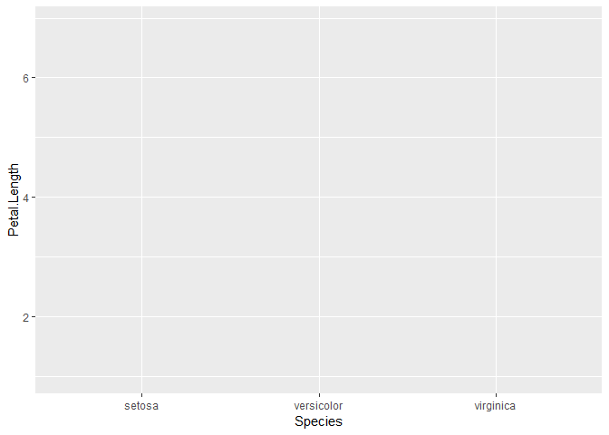
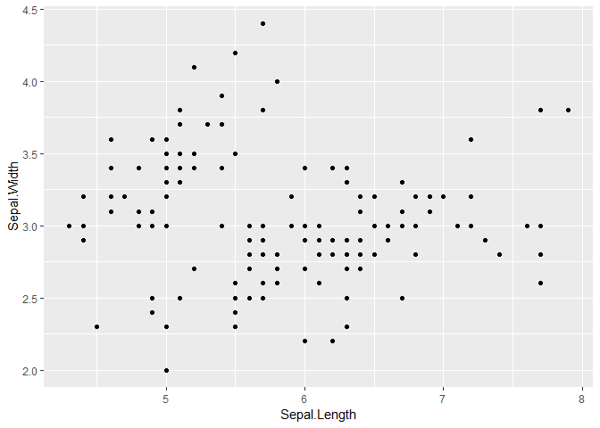
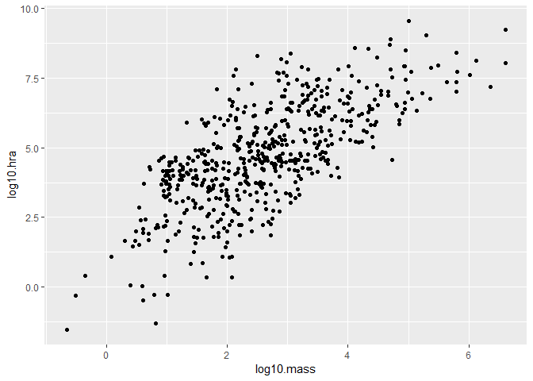
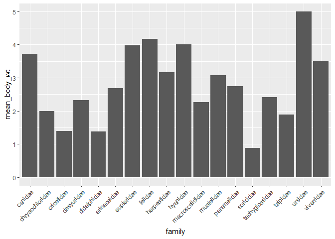
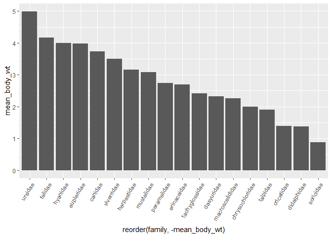
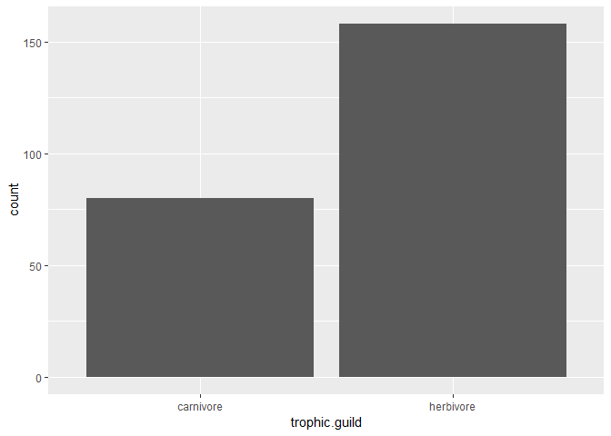
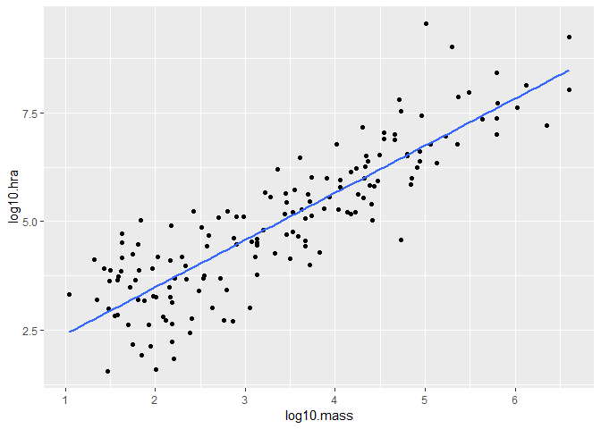
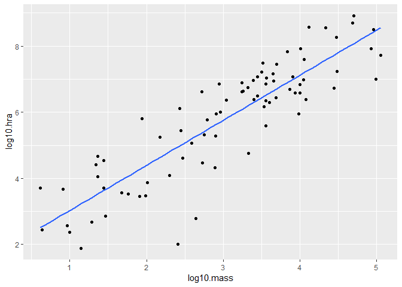

# CLASS INTRO

## Where have we been, and where are we going?
At this point you should feel reasonably comfortable working in RStudio and using dplyr and tidyr. You also know how to produce statistical summaries of data and deal with NA's. It is OK if you need to go back through the labs and find bits of code that work for you, but try and force yourself to originate new chunks.  

## Group Project
Meet with your group and decide on a data set that you will use for your project. Be prepared to discuss these data, where you found them, and what you hope to learn.  
- make sure it's not too messy; be mindful of data quality

## Homework #4 Review
- if already installed a package, comment it out before you knit because you can't install what's already installed
- why pipe summarize function? 
(line 58 
  *msleep* %>% #should be life_history instead of msleep
    summarize(number_nas= sum(is.na(life_history))))
    it's for organization so you know where the data is coming from; less liable to make mistakes
- Reminder: summarize is used w/ group_by (smush together things)
  

##Resources
- [ggplot2 cheatsheet](https://www.rstudio.com/wp-content/uploads/2015/03/ggplot2-cheatsheet.pdf)
- [R for Data Science](https://r4ds.had.co.nz/)
- [R Cookbook](http://www.cookbook-r.com/)
- [`ggplot` themes](https://ggplot2.tidyverse.org/reference/ggtheme.html)
- [Rebecca Barter `ggplot` Tutorial](http://www.rebeccabarter.com/blog/2017-11-17-ggplot2_tutorial/)


# LAB 5-1: DATA VISUALIZATION I

## Learning Goals
*At the end of this exercise, you will be able to:*    
1. Understand and apply the syntax of building plots using `ggplot2`.  
2. Build a boxplot using `ggplot2`.  
3. Build a scatterplot using `ggplot2`.  
4. Build a barplot using `ggplot2` and show the difference between `stat=count` and `stat=identity`.  

### Load the libraries

```r
library(tidyverse)
library(skimr)
```

## Grammar of Graphics (ggplot)
The ability to quickly produce and edit beautiful graphs and charts is a strength of R. These data visualizations are produced by the package `ggplot2` and it is a core part of the tidyverse. The syntax for using ggplot is specific and common to all of the plots. This is what Hadley Wickham calls a [Grammar of Graphics](http://vita.had.co.nz/papers/layered-grammar.pdf). The "gg" in `ggplot` stands for grammar of graphics.
> Plots are built in layers
> - important to make them nice too look at but also not too messy

## Philosophy
What makes a good chart? In my opinion a good chart is elegant in its simplicity. It provides a clean, clear visual of the data without being overwhelming to the reader. This can be hard to do and takes some careful thinking. Always keep in mind that the reader will almost never know the data as well as you do so you need to be mindful about presenting the facts.  

## Data Types
While this isn't a statistics class, we need to define some of the data types we will use to build plots.  

+ `discrete` quantitative data that only contains integers
+ `continuous` quantitative data that can take any numerical value
+ `categorical` qualitative data that can take on a limited number of values

> plot you make depends on data you have

## Basics
The syntax used by ggplot takes some practice to get used to, especially for customizing plots, but the basic elements are the same. It is helpful to think of plots as being built up in layers. In short, **plot= data + geom_ + aesthetics**.  

We start by calling the ggplot function, identifying the data, and specifying the axes. We then add the `geom` type to describe which type of plot we want to make. Each `geom_` works with specific types of data and R is capable of building plots of single variables, multiple variables, and even maps. Lastly, we add aesthetics.

## Example
To make things easy, let's start with some built in data.

```r
?iris
```

```
## starting httpd help server ... done
```

```r
names(iris) #always look for colnames
```

```
## [1] "Sepal.Length" "Sepal.Width"  "Petal.Length" "Petal.Width" 
## [5] "Species"
```

```r
iris <- iris #take data and make it into object so you can viewobject; not necessary 
```

To make a plot, we need to first specify the data and map the aesthetics. The aesthetics include how each variable in our dataset will be used. In the example below, I am using the aes() function to identify the x and y variables in the plot.

```r
#need specific syntax, doublecheck that tidyverse is loaded
ggplot(data=iris, mapping=aes(x=Species, y=Petal.Length)) #ggplot(data, what you want to plot (x axis, y axis)) 
```

<!-- -->
> Note: specifying axis is specifying a col

Notice that we have a nice background, labeled axes, and even values of our variables- but no plot. This is because we need to tell ggplot what type of plot we want to make. This is called the geometry or `geom()`.

Here we specify that we want a boxplot, indicated by `geom_boxplot()`.

```r
ggplot(data=iris, mapping=aes(x=Species, y=Petal.Length))+
  geom_boxplot()
```

<!-- -->
> So have 'ggplot' specify what data using, add a '+' to layer and then 'geom()'for type of plot; DO NOT put a pipe, it'll give an error

### Practice: iris
1. Take a moment to practice. Use the iris data to build a scatterplot that compares sepal length vs. sepal width. Use the cheatsheet to find the correct `geom_` for a scatterplot.

```r
ggplot(data=iris, mapping=aes(x=Sepal.Length, y=Sepal.Width)) +
  geom_point()
```

<!-- -->

## Scatterplots, barplots, and boxplots
Now that we have a general idea of the syntax, let's start by working with two standard plots: 1) scatterplots and 2) barplots.

## Data
For the following examples, I am going to use data about vertebrate home range sizes.  

**Database of vertebrate home range sizes.**  
Reference: Tamburello N, Cote IM, Dulvy NK (2015) Energy and the scaling of animal space use. The American Naturalist 186(2):196-211. http://dx.doi.org/10.1086/682070.  
Data: http://datadryad.org/resource/doi:10.5061/dryad.q5j65/1  


```r
homerange <- 
  readr::read_csv("C:/Users/Apple/Desktop/aptruong/data/Tamburelloetal_HomeRangeDatabase.csv")
```

A little bit of cleaning to focus on the variables of interest. Good `dplyr` practice!

```r
homerange <- 
  homerange %>%  
  select(common.name, taxon, family, genus, species, mean.mass.g, log10.mass, mean.hra.m2, log10.hra, preymass, log10.preymass, trophic.guild)
```


```r
names(homerange)
```

```
##  [1] "common.name"    "taxon"          "family"         "genus"         
##  [5] "species"        "mean.mass.g"    "log10.mass"     "mean.hra.m2"   
##  [9] "log10.hra"      "preymass"       "log10.preymass" "trophic.guild"
```

### 1. Scatter Plots
Scatter plots are good at revealing relationships that are not readily visible in the raw data. For now, we will not add regression lines or calculate any r^2^ values. In this case, we are exploring whether or not there is a relationship between animal mass and homerange. We are using log transformed values because there is a very large difference in mass and homerange among the different  species in the data.

```r
ggplot(data=homerange, mapping=aes(x=log10.mass, y=log10.hra)) +
  geom_point()
```

<!-- -->
> so there is a (+) relationship. bigger animal, bigger homerange it needs
> Note: a lot of overlapping, dense points

In big data sets with lots of similar values, overplotting can be an issue. `geom_jitter()` is similar to `geom_point()` but it helps with overplotting by adding some random noise to the data and separating some of the individual points.

```r
ggplot(data=homerange, mapping=aes(x=log10.mass, y=log10.hra)) +
  geom_jitter()
```

<!-- -->

You want to see the regression line, right?

```r
ggplot(data=homerange, mapping=aes(x=log10.mass, y=log10.hra)) +
  geom_jitter()+
  geom_smooth(method=lm, se=FALSE) 
```

<!-- -->
> this is adding another layer
> regression line shows how clearly the (+) relationship is
> Note: scatterplot specify continuous numeric data, not really for categorical data

### 2A. Bar Plot: `stat="count"`
When making a bar graph, the default is to count the number of observations in the specified column. This is best for categorical data and is defined by the aesthetic `stat="count"`. Here, I want to know how many carnivores vs. herbivores are in the data.  

Notice that we can use pipes and the `mapping=` function is implied by `aes` and so is often left out.  

```r
homerange %>% 
  ggplot(aes(x=trophic.guild))+ #don't need to type in mapping b/c ggplot already knows what that means, just need 'aes'; don't tell what y-axis is, it knows
  geom_bar(stat="count") # I am identifying stat="count" but this isn't necessary since it is default
```

<!-- -->


```r
homerange %>% 
  ggplot(aes(x=trophic.guild))+ 
  geom_bar() 
```

<!-- -->
> Note: bar plot still make count by default


### 2B. Bar Plot: `stat="identity"`
`stat="identity"` allows us to map a variable to the y axis so that we aren't restricted to count. Let's use our dplyr skills to first filter out carnivorous mammals and see which families have the highest mean body weight.

```r
carni_mammals <- 
  homerange %>% 
  filter(taxon=="mammals", 
         trophic.guild=="carnivore") %>% 
  group_by(family) %>% 
  summarize(count=n(),
            mean_body_wt=mean(log10.mass)) %>% 
  arrange(desc(mean_body_wt))
carni_mammals
```

```
## # A tibble: 18 x 3
##    family          count mean_body_wt
##    <chr>           <int>        <dbl>
##  1 ursidae             1        4.99 
##  2 felidae            19        4.16 
##  3 hyanidae            1        4    
##  4 eupleridae          1        3.98 
##  5 canidae             7        3.73 
##  6 viverridae          3        3.49 
##  7 herpestidae         5        3.16 
##  8 mustelidae         15        3.08 
##  9 peramelidae         2        2.74 
## 10 erinaceidae         2        2.69 
## 11 tachyglossidae      1        2.41 
## 12 dasyuridae          4        2.32 
## 13 macroscelididae     3        2.27 
## 14 chrysochloridae     2        2.00 
## 15 talpidae            4        1.90 
## 16 cricetidae          2        1.39 
## 17 didelphidae         2        1.38 
## 18 soricidae           6        0.882
```

Now let's plot the data using `stat="identity"` to help visualize these differences. (Mean body weight of each family of carnivores)

```r
carni_mammals%>% #make sure you tell which data associated with
  ggplot(aes(x=family, y=mean_body_wt))+
  geom_bar(stat="identity")
```

<!-- -->

#### Using theme() to make data legible 
This looks nice, but the x axis is a mess and needs adjustment. We make these adjustments using `theme()`.

```r
carni_mammals%>% 
  ggplot(aes(x=family, y=mean_body_wt))+
  geom_bar(stat="identity")+
  theme(axis.text.x = element_text(angle = 45, hjust=1)) #hjust: how far text is from chart
```

<!-- -->
> Note: again, one variable must be numeric for barplot to work

We can make this a little bit better by reordering.

```r
carni_mammals%>% 
  ggplot(aes(x=reorder(family, -mean_body_wt), y=mean_body_wt))+
  geom_bar(stat="identity")+
  theme(axis.text.x = element_text(angle = 60, hjust=1))
```

<!-- -->
> use reorder fxn to put in desc order; not needed for all data

Or we can flip the coordinates.

```r
carni_mammals%>% 
  ggplot(aes(x=reorder(family, -mean_body_wt), y=mean_body_wt))+
  geom_bar(stat="identity")+
  coord_flip()
```

<!-- -->
> this turns plot on the side, don't need to worry about changing angle of text 

## Practice: plots
Filter the `homerange` data to include `mammals` only.

```r
mammals <- 
  homerange %>% 
  filter(taxon=="mammals") %>% 
  select(common.name, family, genus, species, trophic.guild, mean.mass.g, log10.mass, mean.hra.m2, log10.hra, preymass, log10.preymass)
```


```r
mammals
```

```
## # A tibble: 238 x 11
##    common.name family genus species trophic.guild mean.mass.g log10.mass
##    <chr>       <chr>  <chr> <chr>   <chr>               <dbl>      <dbl>
##  1 giant gold~ chrys~ chry~ trevel~ carnivore            437.       2.64
##  2 Grant's go~ chrys~ erem~ granti  carnivore             23        1.36
##  3 pronghorn   antil~ anti~ americ~ herbivore          46100.       4.66
##  4 impala      bovid~ aepy~ melamp~ herbivore          63504.       4.80
##  5 hartebeest  bovid~ alce~ busela~ herbivore         136000.       5.13
##  6 barbary sh~ bovid~ ammo~ lervia  herbivore         167498.       5.22
##  7 American b~ bovid~ bison bison   herbivore         629999.       5.80
##  8 European b~ bovid~ bison bonasus herbivore         628001.       5.80
##  9 goat        bovid~ capra hircus  herbivore          51000.       4.71
## 10 Spanish ib~ bovid~ capra pyrena~ herbivore          69499.       4.84
## # ... with 228 more rows, and 4 more variables: mean.hra.m2 <dbl>,
## #   log10.hra <dbl>, preymass <dbl>, log10.preymass <dbl>
```

1. Are there more herbivores or carnivores in mammals? Make a bar plot that shows their relative proportions.

```r
mammals%>% 
  ggplot(aes(x=trophic.guild))+
  geom_bar(stat="count")
```

<!-- -->
> there are more herbivores than carnivores in mammals

2. Is there a positive or negative relationship between mass and homerange? How does this compare between herbivores and carnivores? Make two plots that illustrate these examples below.  

```r
mammals %>%
  filter(trophic.guild=="herbivore") %>%
  ggplot(mapping=aes(x=log10.mass, y=log10.hra)) +
  geom_point() +
  geom_smooth(method=lm, se=FALSE)
```

<!-- -->

```r
mammals %>%
  filter(trophic.guild=="carnivore") %>%
  ggplot(mapping=aes(x=log10.mass, y=log10.hra)) +
  geom_point() +
  geom_smooth(method=lm, se=FALSE)
```

<!-- -->


3. Make a barplot that shows the masses of the top 10 smallest mammals in terms of mass. Be sure to use `stat'="identity"`.

```r
#first find top 10 smallest mammals (note: lots of ways to do this)
homerange %>% 
  filter(taxon=="mammals") %>% 
  select(common.name, mean.mass.g) %>% 
  arrange((mean.mass.g))
```

```
## # A tibble: 238 x 2
##    common.name                    mean.mass.g
##    <chr>                                <dbl>
##  1 cinereus shrew                        4.17
##  2 slender shrew                         4.37
##  3 arctic shrew                          8.13
##  4 crowned shrew                         9.33
##  5 greater white-footed shrew           10   
##  6 salt marsh harvest mouse             11.0 
##  7 long-clawed shrew                    14.1 
##  8 Northern three-striped opossum       19.5 
##  9 wood mouse                           21.2 
## 10 southern grasshopper mouse           22   
## # ... with 228 more rows
```
Another method is to do...

```r
homerange %>% 
  top_n(5, log10.mass) %>% 
  ggplot(aes(x=common.name, y=log10.mass))+
  geom_bar(stat="identity")+
  coord_flip()
```

<!-- -->

## Closing
- can now do scatterplots & barplots
- can apply ddplyr

# LAB 5-2: DATA VISUALIZATION II

