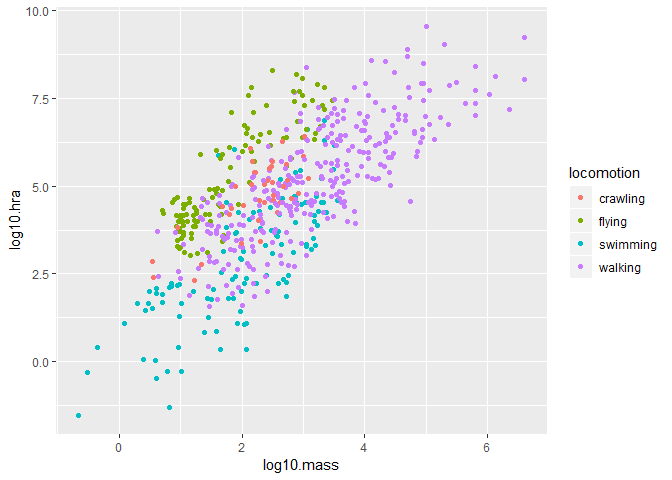

## Review
Now that you have been introduced to `ggplot`, we need to practice a few more plot types and learn how to manipulate the aesthetics of plots to better suit our needs. Aesthetics can make a significant difference visually, but you can take it too far so remember that our goal is to produce clean plots that are not too distracting.  

## HW#5 Review
- R won't plot NA's, that's why have to deal with them
- Review: we should know how to make scatterplots and barplots 

##Resources
- [ggplot2 cheatsheet](https://www.rstudio.com/wp-content/uploads/2015/03/ggplot2-cheatsheet.pdf)
- [R for Data Science](https://r4ds.had.co.nz/)
- [R Cookbook](http://www.cookbook-r.com/)
- [`ggplot` themes](https://ggplot2.tidyverse.org/reference/ggtheme.html)
- [Rebecca Barter `ggplot` Tutorial](http://www.rebeccabarter.com/blog/2017-11-17-ggplot2_tutorial/)

## Load the libraries

```r
library(tidyverse)
library(skimr)
```

### Box Plots
> box plots plot a range; needs to be a range of values

Let's briefly return to the `homerange` data and filter out carnivorous mammals. We can use a boxplot to visualize the differences in body mass by family.

```r
homerange <- 
  readr::read_csv("C:/Users/Apple/Desktop/FRS417/class_files-master/data/Tamburelloetal_HomeRangeDatabase.csv", na = c("", " ", ",","NA","#N/A","-999"))
#'na=' fix NA's at the get-go
```

>Note: if num col called charac, usually b/c of unaddressed NA's


```r
carni_mammals <- 
  homerange %>% 
  filter(taxon=="mammals", trophic.guild=="carnivore")
carni_mammals
```

```
## # A tibble: 80 x 24
##    taxon common.name class order family genus species primarymethod N    
##    <chr> <chr>       <chr> <chr> <chr>  <chr> <chr>   <chr>         <chr>
##  1 mamm~ giant gold~ mamm~ afro~ chrys~ chry~ trevel~ telemetry*    <NA> 
##  2 mamm~ Grant's go~ mamm~ afro~ chrys~ erem~ granti  telemetry*    <NA> 
##  3 mamm~ arctic fox  mamm~ carn~ canid~ alop~ lagopus telemetry*    <NA> 
##  4 mamm~ Ethiopian ~ mamm~ carn~ canid~ canis simens~ telemetry*    <NA> 
##  5 mamm~ culpeo      mamm~ carn~ canid~ pseu~ culpae~ telemetry*    <NA> 
##  6 mamm~ South Amer~ mamm~ carn~ canid~ pseu~ griseus telemetry*    <NA> 
##  7 mamm~ kit fox     mamm~ carn~ canid~ vulp~ macroti telemetry*    <NA> 
##  8 mamm~ Ruppel's f~ mamm~ carn~ canid~ vulp~ ruppel~ telemetry*    <NA> 
##  9 mamm~ swift fox   mamm~ carn~ canid~ vulp~ velox   telemetry*    <NA> 
## 10 mamm~ fossa       mamm~ carn~ euple~ cryp~ ferox   telemetry*    <NA> 
## # ... with 70 more rows, and 15 more variables: mean.mass.g <dbl>,
## #   log10.mass <dbl>, alternative.mass.reference <chr>, mean.hra.m2 <dbl>,
## #   log10.hra <dbl>, hra.reference <chr>, realm <chr>,
## #   thermoregulation <chr>, locomotion <chr>, trophic.guild <chr>,
## #   dimension <chr>, preymass <dbl>, log10.preymass <dbl>, PPMR <dbl>,
## #   prey.size.reference <chr>
```


```r
carni_mammals %>% 
  ggplot(aes(x=family, y=log10.mass))+
  geom_boxplot()+
  theme(axis.text.x = element_text(angle = 60, hjust=1))
```

<!-- -->


### Practice: Box Plots
1. What do you think those solid lines represent in the box plot above? Use `count` to determine which families have the largest and smallest sample sizes.

```r
homerange %>% 
  count(family) %>% 
  arrange(desc(n))
```

```
## # A tibble: 150 x 2
##    family           n
##    <chr>        <int>
##  1 sciuridae       25
##  2 colubridae      22
##  3 cricetidae      20
##  4 bovidae         19
##  5 felidae         19
##  6 serranidae      18
##  7 accipitridae    16
##  8 mustelidae      15
##  9 viperidae       15
## 10 labridae        14
## # ... with 140 more rows
```

```r
homerange %>% 
  count(family) %>% 
  arrange((n))
```

```
## # A tibble: 150 x 2
##    family             n
##    <chr>          <int>
##  1 acrocephalisae     1
##  2 aegithalidae       1
##  3 agamidae           1
##  4 ailuridae          1
##  5 alaudidae          1
##  6 anatidae           1
##  7 anguillidae        1
##  8 antilocapridae     1
##  9 aplodontiidae      1
## 10 apterygidae        1
## # ... with 140 more rows
```
> sciuridae has largest family sample size


2. Rebuild the plot only for the top five families with the largest sample sizes. How is `ggplot` ordering families on the x-axis?


3. There are more herbivores than carnivores in the homerange data, but how do their masses compare? Make a boxplot that compares their masses. Use `log10.mass`.

```r
#comparison of herb & carn masses
homerange %>% 
  ggplot(aes(x=trophic.guild, y=log10.mass))+
  geom_boxplot()
```

<!-- -->
> Note remember: barplot for plotting count, boxplot for plotting range


## Aesthetics: Labels
Now that we have practiced scatterplots, barplots, and boxplots we need to learn how to adjust their appearance to suit our needs. Let's start with labelling x and y axes.  

In this example, we explored the relationship between body mass and homerange.

```r
ggplot(data=homerange, mapping=aes(x=log10.mass, y=log10.hra)) +
  geom_point()
```

<!-- -->
> Note: (+) rel b/t how big+
  labs(title = "Mass vs. Homerange",
       x = "Mass (log10)",
       y = "Homerange (log10)") you are and how much space need. however, somene unfamiliar w/ data can't read. need to label!

The plot looks clean, but it is incomplete. A reader unfamiliar with the data might have a difficult time interpreting the plot with labels. To add labels, we use the `labs` command.
> Note: not piping anything, jsut adding another layer


```r
ggplot(data=homerange, mapping=aes(x=log10.mass, y=log10.hra)) +
  geom_point()
```

<!-- -->
> Note: all plots need clearly labelled titles & axes

We can improve the plot further by adjusting the size and condition of the text.

```r
ggplot(data=homerange, mapping=aes(x=log10.mass, y=log10.hra)) +
  geom_point()+
  labs(title = "Mass vs. Homerange",
       x = "Mass (log10)",
       y = "Homerange (log10)")+
    theme(plot.title=element_text(size=18, face="bold"),
        axis.text=element_text(size=12),
        axis.title=element_text(size=12))
```

<!-- -->
> Note: there are a lot of cool themes, but rn just adjusting size and bold it; all cosmetic & fully adjustable 
> .text for number labels; .title for label labels

The `rel` option changes the relative size of the title to keep things consistent. Adding `hjust` allows control of title position.

```r
ggplot(data=homerange, mapping=aes(x=log10.mass, y=log10.hra)) +
  geom_point()+
  labs(title = "Mass vs. Homerange",
       x = "Mass (log10)",
       y = "Homerange (log10)")+ 
  theme(plot.title = element_text(size = rel(2), hjust = 0.5))
```

<!-- -->
> Note: rel automatic adjust for youl; hjust was used to center the title (0 = left, 0.5 = middle, 1 = right)

### Practice: Labels
1. Make a plot that shows the number of individuals per locomotion type. Be sure to provide a title and label the axes appropriately.

```r
colnames(homerange)
```

```
##  [1] "taxon"                      "common.name"               
##  [3] "class"                      "order"                     
##  [5] "family"                     "genus"                     
##  [7] "species"                    "primarymethod"             
##  [9] "N"                          "mean.mass.g"               
## [11] "log10.mass"                 "alternative.mass.reference"
## [13] "mean.hra.m2"                "log10.hra"                 
## [15] "hra.reference"              "realm"                     
## [17] "thermoregulation"           "locomotion"                
## [19] "trophic.guild"              "dimension"                 
## [21] "preymass"                   "log10.preymass"            
## [23] "PPMR"                       "prey.size.reference"
```

```r
ggplot(data=homerange, aes(x=locomotion))+ #note, no y= b/c barplot is for making counts
  geom_bar()+
  labs(title = "Locomotion Type",
       x = "Locomotion Type",
       y = "# Individuals")+ 
  theme(plot.title = element_text(size = rel(2), hjust = 0.5))+
  coord_flip() #just to flip
```

<!-- -->


## Other Aesthetics
There are lots of options for aesthtics. An aesthetic can be either numeric or categorical. `color` is a common option; notice that an appropriate key is displayed when you use one of the aesthetic options.

```r
homerange %>% 
  ggplot(aes(x=log10.mass, y=log10.hra, color=locomotion))+
  geom_point()
```

<!-- -->
> Note: this is coloring by locomotion type (basically coloring by another variable)


```r
homerange %>% 
  ggplot(aes(x=log10.mass, y=log10.hra ))+
  geom_point(color = "red")
```

<!-- -->
> Note: this is just recoloring the points. not as informative, but it's something you can do. there are many colors to choose from. 

`size` adjusts the size of points relative to a continuous variable (like mass)

```r
homerange %>% 
  ggplot(aes(x=log10.mass, y=log10.hra, size=mean.mass.g))+
  geom_point()
```

<!-- -->
> Analysis: animals w/ biggest mass need more room

Here I am plotting `class` on the x-axis and `log10.mass` on the y-axis. I use `group` to make individual box plots for each taxon. I also use `fill` so I can associate the different taxa with a color coded key.

```r
homerange %>% 
  ggplot(aes(x=class, y=log10.mass, group=taxon, fill=class))+ #doing this groups by taxon & then colororganizing by class
  geom_boxplot()
```

<!-- -->

```r
homerange %>% 
  ggplot(aes(x=class, y=log10.mass, group=taxon, fill=taxon))+ #doing this separates by taxon and organizing by taxon
  geom_boxplot()
```

<!-- -->
> Note: R is pixking colors randomly for you

### Practice: other aesthetics 
1. Make a barplot that shows counts of ectotherms and endotherms. Label the axes, provide a title, and fill by thermoregulation type.

```r
  ggplot(data=homerange, aes(x=thermoregulation, fill=thermoregulation))+ 
  geom_bar()+
  labs(title = "Counts of Ectotherms & Endotherms",
       x = "Thermoregulation Type",
       y = "# Individuals")+ 
  theme(plot.title = element_text(size = rel(1.5), hjust = 0.5))
```

<!-- -->


2. Make a boxplot that compares thermoregulation type by mog10.mass. group and fill by class. Label the axes and provide a title.

```r
homerange %>% 
  ggplot(aes(x=thermoregulation, y=log10.mass, group=class, fill=class))+ #doing this separates by taxon and organizing by taxon
  geom_boxplot()+
  labs(title = "Thermoregulation Type by Mass per Class",
       x = "Thermoregulation Type",
       y = "Mass (log10)")+ 
  theme(plot.title = element_text(size = rel(1.5), hjust = 0.5))
```

<!-- -->


## Wrap-up
Please review the learning goals and be sure to use the code here as a reference when completing the homework.

See you next time!
