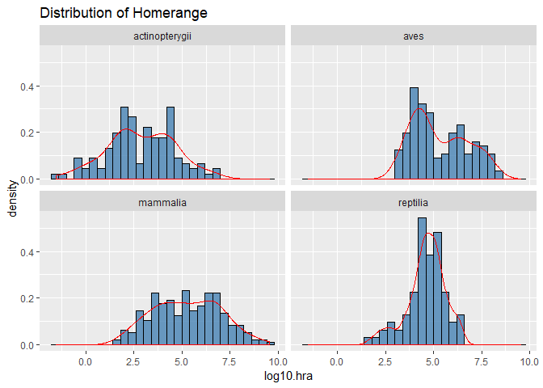

# Lab 6-1: VISUALIZATION 3

## Resources
- [ggplot2 cheatsheet](https://www.rstudio.com/wp-content/uploads/2015/03/ggplot2-cheatsheet.pdf)
- [R for Data Science](https://r4ds.had.co.nz/)
- [R Cookbook](http://www.cookbook-r.com/)

## Intro to CLass
- download github desktop to help w/ my problem to uploading image files

## Learning Goals
*At the end of this exercise, you will be able to:*    
1. Build stacked barplots of categorical variables.  
2. Build side-by-side barplots using `position= "dodge"`.  
3. Customize colors in plots using `RColorBrewer` and `paletteer`.  
4. Build histograms and density plots.  

## Load the libraries

```r
library(tidyverse)
```


```r
options(scipen=999) #cancels the use of scientific notation for the session
```
> any # larger than 999 convert to sci-not, and graphs will display in sci-not

## Data
**Database of vertebrate home range sizes.**  
Reference: Tamburello N, Cote IM, Dulvy NK (2015) Energy and the scaling of animal space use. The American Naturalist 186(2):196-211. http://dx.doi.org/10.1086/682070.  
Data: http://datadryad.org/resource/doi:10.5061/dryad.q5j65/1  


```r
homerange <- 
  readr::read_csv("C:/Users/Apple/Desktop/aptruong/data/Tamburelloetal_HomeRangeDatabase.csv", na = c("", " ", "NA", "#N/A", "-999", "\\"))
```

## Barplots revisited
At this point you should be able to build a barplot that shows counts of observations in a variable using `geom_bar()`. But, you should also be able to use `stat="identity"` to specify both x and y axes.  

Although we did not use it last time, `geom_col()` is the same as specifying `stat="identity"` using `geom_bar()`.     

### Here is the plot using `geom_bar(stat="identity")`

```r
homerange %>% 
  filter(family=="salmonidae") %>% #filter for salmonid fish only
  ggplot(aes(x=common.name, y=log10.mass))+
  geom_bar(stat="identity")
```

<!-- -->
> stat = "count" is the default; here it is NOT a count cuz specified x and y axis
> acceptable to use 'geom_col()'

### Practice: Barplots
1. Make the same plot above, but use `geom_col()`

```r
homerange %>% 
  filter(family=="salmonidae") %>% #filter for salmonid fish only
  ggplot(aes(x=common.name, y=log10.mass, fill=common.name))+
  labs(title = "Mass of Salmon",
       x = "Salmon",
       y = "Mass (log10)")+
  geom_col()
```

<!-- -->


## Barplots and multiple variables
Last time we explored the `fill` option in boxplots as a way to bring color to the plot; i.e. we filled by the same variable that we were plotting. What happens when we fill by a different categorical variable? 

Let's start by counting how many obervations we have in each taxonomic group.

```r
homerange %>% 
  count(taxon)
```

```
## # A tibble: 9 x 2
##   taxon             n
##   <chr>         <int>
## 1 birds           140
## 2 lake fishes       9
## 3 lizards          11
## 4 mammals         238
## 5 marine fishes    90
## 6 river fishes     14
## 7 snakes           41
## 8 tortoises        12
## 9 turtles          14
```

Now let's make a barplot of these data.

```r
homerange %>% 
  ggplot(aes(x=taxon))+
  geom_bar(alpha=0.9, na.rm=TRUE)+
  coord_flip()+
  labs(title = "Observations by Taxon in Homerange Data",
       x = "Taxonomic Group")
```

<!-- -->

By specifying `fill=trophic.guild` we build a stacked bar plot that shows the proportion of a given taxonomic group that is an herbivore or carnivore.

```r
homerange %>% 
  ggplot(aes(x=taxon, fill=trophic.guild))+
  geom_bar(alpha=0.9, na.rm=T)+
  coord_flip()+
  labs(title = "Observations by Taxon in Homerange Data",
       x = "Taxonomic Group",
       fill= "Trophic Guild")
```

<!-- -->
> makes stacked bar plot; show proportion in each bar of which trophic guild

We can also have the proportions of each trophic guild within taxonomic group shown side-by-side by specifying `position="dodge"`.

```r
homerange %>% 
  ggplot(aes(x=taxon, fill=trophic.guild))+  #fill by categorical variable (trophic guild)
  geom_bar(alpha=0.9, na.rm=T, position="dodge")+  #goes into geom_bar; alpha is transparency
  theme(legend.position = "right",
        axis.text.x = element_text(angle = 60, hjust=1))+
  labs(title = "Observations by Taxon in Homerange Data",
       x = "Taxonomic Group",
       fill= "Trophic Guild")+
  coord_flip()
```

<!-- -->

### Practice: Barplots and multiple variables
1. Make a barplot that shows locomotion type by `primarymethod`. Try both a stacked barplot and `position="dodge"`.

```r
homerange %>% 
  ggplot(aes(x=locomotion, fill=primarymethod))+  #fill by categorical variable (trophic guild)
  geom_bar(alpha=0.9, na.rm=T, position="dodge")+  #goes into geom_bar 
  theme(legend.position = "right",
        axis.text.x = element_text(angle = 60, hjust=1))+
  labs(title = "Observations by Locomotion in Homerange Data",
       x = "Locomotion",
       fill= "Locomotion Type")
```

<!-- -->

don't lose sense of proportion

```r
homerange %>% 
  ggplot(aes(x=locomotion,fill=primarymethod))+
  geom_bar(position=position_fill(), stat="count")+
  scale_y_continuous(labels=scales::percent)
```

<!-- -->
> More reflective of proportion in locomotion 

## Histograms and Density Plots
Histograms are frequently used by biologists; they show the distribution of continuous variables. As students, you almost certainly have seen histograms of grade distributions. Without getting into the statistics, a histogram `bins` the data and you specify the number of bins that encompass a range of observations. For something like grades, this is easy because the number of bins corresponds to the grades A-F. By default, R uses a formula to calculate the number of bins but some adjustment is often required.  
> Note: need to specify # of bins
> eg: when doing grades, it's clearer b/c A, B, C, etc.
> Historgram diff from straight count, it does distribution

What does the distribution of body mass look like in the homerange data?

```r
homerange %>% 
  ggplot(aes(x=log10.mass)) +
  geom_histogram(fill="steelblue", alpha=0.8, color="black")+
  labs(title = "Distribution of Body Mass")
```

```
## `stat_bin()` using `bins = 30`. Pick better value with `binwidth`.
```

<!-- -->
> only thing added is a new geom type; the aesthetic is to make more well defined; reduce alpha = inc transparency, can see lines behind plot

`Density plots` are similar to histograms but they use a smoothing function to make the distribution more even and clean looking. They do not use bins.

```r
homerange %>% 
  ggplot(aes(x=log10.mass)) +
  geom_density(fill="steelblue", alpha=0.4)+
  labs(title = "Distribution of Body Mass")
```

<!-- -->
> end up w/ curve instead of bin

I like to see both the histogram and the density curve so I often plot them together. Note that I assign the density plot a different color.

```r
homerange %>% 
  ggplot(aes(x=log10.mass)) +
  geom_histogram(aes(y = ..density..), binwidth = .4, fill="steelblue", alpha=0.8, color="black")+
  geom_density(color="red")+
  labs(title = "Distribution of Body Mass")
```

<!-- -->
> histogram w/ density plot overlay

### Practice: Histogram & Density Plots
1. Make a histogram of `log10.hra`. Make sure to add a title.

```r
homerange %>% 
  ggplot(aes(x=log10.hra)) +
  geom_histogram(fill="steelblue", alpha=0.8, color="black")+
  labs(title = "Distribution of Homerange")
```

```
## `stat_bin()` using `bins = 30`. Pick better value with `binwidth`.
```

<!-- -->

2. Now plot the same variable using `geom_density()`.

```r
homerange %>% 
  ggplot(aes(x=log10.hra)) +
  geom_density(fill="steelblue", alpha=0.4)+
  labs(title = "Distribution of Homerange")
```

<!-- -->

3. Combine them both!

```r
homerange %>% 
  ggplot(aes(x=log10.hra)) +
  geom_histogram(aes(y = ..density..), binwidth = .4, fill="steelblue", alpha=0.8, color="black")+
  geom_density(color="red")+
  labs(title = "Distribution of Homerange")
```

<!-- -->


# LAB 6-2: VISUALIZING DATA 4

## Learning Goals
*At the end of this exercise, you will be able to:*    
1. Adjust x and y axis limits on plots.  
2. Use faceting to display plots for multiple variables simultaneously.
3. Use RColorBrewer to specify a custom color theme.

## Load the tidyverse

```r
#library(tidyverse)
#options(scipen=999)
```

## Data
**Database of vertebrate home range sizes.**  
Reference: Tamburello N, Cote IM, Dulvy NK (2015) Energy and the scaling of animal space use. The American Naturalist 186(2):196-211. http://dx.doi.org/10.1086/682070.  
Data: http://datadryad.org/resource/doi:10.5061/dryad.q5j65/1  

```r
homerange <- 
  readr::read_csv("C:/Users/Apple/Desktop/FRS417/class_files-master/data/Tamburelloetal_HomeRangeDatabase.csv", na = c("", " ", "NA", "#N/A", "-999", "\\"))
```

```
## Parsed with column specification:
## cols(
##   .default = col_character(),
##   mean.mass.g = col_double(),
##   log10.mass = col_double(),
##   mean.hra.m2 = col_double(),
##   log10.hra = col_double(),
##   preymass = col_double(),
##   log10.preymass = col_double(),
##   PPMR = col_double()
## )
```

```
## See spec(...) for full column specifications.
```

## Review color and fill options
We have learned that there are a variety of color and fill options in `ggplot`. These are helpful in making plots more informative and visually appealing; i.e., in this scatterplot we show the relationship between mass and homerange while coloring the points by a different variable.

```r
homerange %>% 
  ggplot(aes(x=log10.mass, y=log10.hra, color=locomotion))+
  geom_point()
```

<!-- -->

We can change the color of the points universally instead of using `fill`, but we need to put this into a different layer and specify the exact color. Notice the different options! Experiment by adjusting them.

```r
homerange %>% 
  ggplot(aes(x=log10.mass, y=log10.hra))+
  geom_point(shape = 21, colour = "black", fill = "steelblue", size = 2.5, stroke = 0.5, alpha=0.75)
```

<!-- -->
> put into geom_point: color puts black edging

### Practice: Color & Fill Options
1. Make a barplot that shows counts of animals by taxonomic class. Fill by thermoregulation type.

```r
homerange %>% 
  ggplot(aes(x=class, fill=thermoregulation))+
  geom_bar()
```

<!-- -->

2. Make a box plot that shows the range of log10.mass by taxonomic class. Use `group` to cluster animals together by taxon and `fill` to color each box by taxon.

```r
homerange %>% 
  ggplot(aes(x=class, y=log10.mass, group=taxon, fill=taxon))+
  geom_boxplot()
```

<!-- -->
> plotting class of animal by mass BUT there's diff taxa by class, so you can show diff taxa by each class
> it's like group_by but for plot
> Note: black line = median, dots = outliers

## Adjusting the x and y limits
There are many options for adjusting the x and y axes. For details, look over examples in the [R Cookbook](http://www.cookbook-r.com/). To adjust limits, we can use the `xlim` and `ylim` commands. When you do this, any data outside the specified ranges are not plotted.

```r
homerange %>% 
  ggplot(aes(x=log10.mass, y=log10.hra, color=locomotion))+
  geom_point()+
  xlim(0, 4)+
  ylim(1, 6)
```

```
## Warning: Removed 175 rows containing missing values (geom_point).
```

<!-- -->
> will pull out data out of range

## Faceting: `facet_wrap()`
Faceting is one of the most amazing features of ggplot. It allows you to make multi-panel plots for easy comparison. Here, I am making histograms of log10.mass for every taxon. We read the `~` in the `facet_wrap()` layer as `by`.

```r
homerange %>% 
  ggplot(aes(x = log10.mass)) +
  geom_histogram() +
  facet_wrap(~taxon) #~ = by
```

```
## `stat_bin()` using `bins = 30`. Pick better value with `binwidth`.
```

<!-- -->
> without faceting, will just get a distribution
> if want to look at range for each taxon and class, would have to indiv filter each taxon or count; this allows you to make indiv histogram per taxa

## Faceting: `facet_grid()`
As you can imagine, there are lots of options for faceting. Another useful facet type is `facet_grid`. This can be helpful when you facet by only a few variables.

```r
homerange %>% 
  ggplot(aes(x = log10.mass)) +
  geom_histogram() +
  facet_grid(~thermoregulation)
```

```
## `stat_bin()` using `bins = 30`. Pick better value with `binwidth`.
```

<!-- -->

### Practice: faceting
1. Use faceting to produce density distributions of log10.mass by taxonomic class.

```r
homerange %>% 
  ggplot(aes(x=log10.mass))+
  geom_density(fill="steelblue", alpha=0.4)+
  facet_wrap(~class)  
```

<!-- -->

2. DIY

```r
homerange %>% 
  ggplot(aes(x=log10.hra)) +
  geom_histogram(aes(y = ..density..), binwidth = .4, fill="steelblue", alpha=0.8, color="black")+
  geom_density(color="red")+
  labs(title = "Distribution of Homerange")+
  facet_wrap(~class)
```

<!-- -->


## RColorBrewer
The default color palettes used by ggplot are often uninspiring. They don't make plots pop out in presentations or publications, and you may want to use a customized palette to make things visually consistent.

```r
#install.packages("RColorBrewer")
library("RColorBrewer")
```

Access the help for RColor Brewer.

```r
#?RColorBrewer
```

The key thing to notice is that there are three different palettes: 1) sequential, 2) diverging, and 3) qualitative. Within each of these there are several selections. You can bring up the colors by using `display.brewer.pal()`. Specify the number of colors that you want and the palette name.

```r
display.brewer.pal(8,"BrBG")
```

<!-- -->
> show 8 colors of this particular palette

> NOTE: keep in mind, if want consistency and keep things always colored same way, use colorbrewer

The [R Color Brewer](http://colorbrewer2.org/#type=sequential&scheme=BuGn&n=3) website is very helpful for getting an idea of the color palettes. To make things easy, use these two guidelines:

+`scale_colour_brewer()` is for points  
+`scale_fill_brewer()` is for fills  


```r
homerange %>% 
  ggplot(aes(x=log10.mass, y=log10.hra, color=locomotion))+
  geom_point(size=1.5, alpha=0.8)+
  scale_colour_brewer(palette = "Dark2")
```

<!-- -->


```r
homerange %>% 
  ggplot(aes(x=thermoregulation, fill=thermoregulation))+
  geom_bar()+
  labs(title = "Thermoregulation Counts",
       x = "Thermoregulation Type",
       y = "# Individuals")+ 
  theme(plot.title = element_text(size = rel(1.25)))+
  scale_fill_brewer(palette = "Dark2")
```

<!-- -->

### Practice: R Color Brewer
1. Build a dodged bar plot that shows the number of carnivores and herbivores filled by taxonomic class. Use a custom color theme.

```r
homerange %>%
  ggplot(aes(x=trophic.guild, fill=class)) +
  geom_bar(alpha=0.9, position="dodge")+
  scale_fill_brewer(palette = "Dark2")
```

<!-- -->
2. DIY

```r
homerange %>% 
  filter(family=="salmonidae") %>% #filter for salmonid fish only
  ggplot(aes(x=common.name, y=log10.mass, fill=common.name))+
  labs(title = "Mass of Salmon",
       x = "Salmon",
       y = "Mass (log10)")+
  geom_col()+
  scale_fill_brewer(palette = "Pastel1")
```

<!-- -->

##
This is good because many packages w/ diff lengths

```r
#another package people use for colors
#install.packages("paletteer")
```


```r
#assign to color all the palettes, so can see all names when u look at 'colors'
# colors <-
#   paletteer::palettes_d_names
# 
# #assign palette name 
# futurama <-
#   paletteer_d(package="ggsci", palette="planetexpress_futurama")
# 
# barplot(rep 4,7), axes=FALSE, col=futurama
```
> note: insert are color="#_____"
>scale_fill_manual(values=my_palette)

## Wrap-up

**Note: data needs to be appropriately tidy!!**

Please review the learning goals and be sure to use the code here as a reference when completing the homework.

-->[Home](https://jmledford3115.github.io/datascibiol/)
