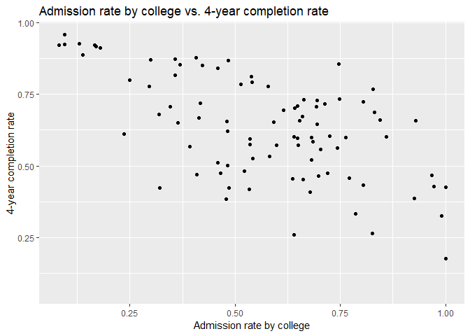
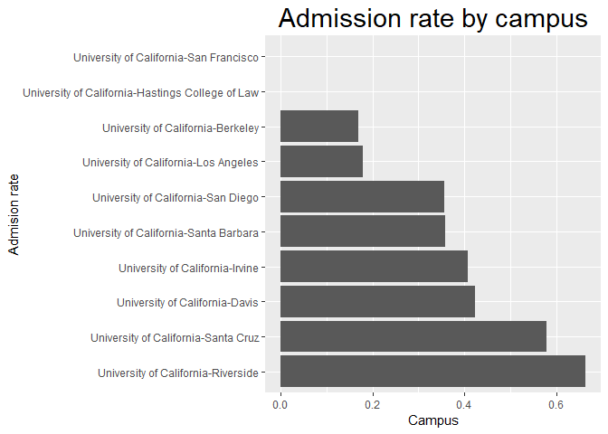

## Instructions
This exam is designed to show me what you have learned and where there are problems. You may use your notes and anything from the `class_files` folder, but please no internet searches. You have 35 minutes to complete as many of these exercises as possible on your own, and 10 minutes to work with a partner.  

At the end of the exam, upload the complete .Rmd file to your GitHub repository.  

1. Load the tidyverse.

```r
library(tidyverse)
```


2. For these questions, we will use data about California colleges. Load the `ca_college_data.csv` as a new object called `colleges`.

```r
colleges <- 
  readr::read_csv("C:/Users/Apple/Desktop/FRS417/class_files-master/data/ca_college_data.csv")
```

```
## Parsed with column specification:
## cols(
##   INSTNM = col_character(),
##   CITY = col_character(),
##   STABBR = col_character(),
##   ZIP = col_character(),
##   ADM_RATE = col_double(),
##   SAT_AVG = col_double(),
##   PCIP26 = col_double(),
##   COSTT4_A = col_double(),
##   C150_4_POOLED = col_double(),
##   PFTFTUG1_EF = col_double()
## )
```


3. Use your preferred function to have a look at the data and get an idea of its structure.

```r
#install.packages("skimr")
library("skimr")
colleges %>% 
  skimr::skim()
```

```
## Skim summary statistics
##  n obs: 341 
##  n variables: 10 
## 
## -- Variable type:character ------------------------------------
##  variable missing complete   n min max empty n_unique
##      CITY       0      341 341   4  19     0      161
##    INSTNM       0      341 341  10  63     0      341
##    STABBR       0      341 341   2   2     0        3
##       ZIP       0      341 341   5  10     0      324
## 
## -- Variable type:numeric --------------------------------------
##       variable missing complete   n     mean        sd        p0      p25
##       ADM_RATE     240      101 341     0.59     0.23     0.081      0.46
##  C150_4_POOLED     221      120 341     0.57     0.21     0.062      0.43
##       COSTT4_A     124      217 341 26685.17 18122.7   7956      12578   
##         PCIP26      35      306 341     0.02     0.038    0          0   
##    PFTFTUG1_EF      53      288 341     0.56     0.29     0.0064     0.32
##        SAT_AVG     276       65 341  1112.31   170.8    870        985   
##       p50       p75     p100     hist
##      0.64     0.75      1    <U+2583><U+2582><U+2585><U+2587><U+2586><U+2587><U+2585><U+2583>
##      0.58     0.72      0.96 <U+2581><U+2583><U+2583><U+2586><U+2587><U+2587><U+2583><U+2585>
##  16591    39289     69355    <U+2587><U+2583><U+2581><U+2582><U+2581><U+2581><U+2581><U+2581>
##      0        0.025     0.22 <U+2587><U+2581><U+2581><U+2581><U+2581><U+2581><U+2581><U+2581>
##      0.5      0.81      1    <U+2581><U+2585><U+2587><U+2586><U+2583><U+2585><U+2583><U+2587>
##   1078     1237      1555    <U+2586><U+2587><U+2585><U+2583><U+2583><U+2582><U+2582><U+2581>
```


4. What are the column names?

```r
colnames(colleges)
```

```
##  [1] "INSTNM"        "CITY"          "STABBR"        "ZIP"          
##  [5] "ADM_RATE"      "SAT_AVG"       "PCIP26"        "COSTT4_A"     
##  [9] "C150_4_POOLED" "PFTFTUG1_EF"
```


5. Are there any NA's in the data? If so, how many are present and in which variables?

```r
colleges %>% 
  summarize(number_nas= sum(is.na(colleges))) 
```

```
## # A tibble: 1 x 1
##   number_nas
##        <int>
## 1        949
```
> Total of 949 NA's


```r
colleges %>% 
  purrr::map_df(~ sum(is.na(.))) %>%
  gather(variable, value = "number_nas") %>%
  arrange(desc(number_nas))
```

```
## # A tibble: 10 x 2
##    variable      number_nas
##    <chr>              <int>
##  1 SAT_AVG              276
##  2 ADM_RATE             240
##  3 C150_4_POOLED        221
##  4 COSTT4_A             124
##  5 PFTFTUG1_EF           53
##  6 PCIP26                35
##  7 INSTNM                 0
##  8 CITY                   0
##  9 STABBR                 0
## 10 ZIP                    0
```
> Variables w/ NA's: SAT_AVG, ADM_RATE, C150_4_POOLED, COSTT4_A, PFTFTUG1_EF, PCIP26


6. Which cities in California have the highest number of colleges?

```r
colleges %>% 
  count(CITY) %>% 
  arrange(desc(n))
```

```
## # A tibble: 161 x 2
##    CITY              n
##    <chr>         <int>
##  1 Los Angeles      24
##  2 San Diego        18
##  3 San Francisco    15
##  4 Sacramento       10
##  5 Berkeley          9
##  6 Oakland           9
##  7 Claremont         7
##  8 Pasadena          6
##  9 Fresno            5
## 10 Irvine            5
## # ... with 151 more rows
```
> Los Angeles has highest number of colleges

7. The column `COSTT4_A` is the annual cost of each institution. Which city has the highest cost?

```r
colleges %>%
  select(CITY, COSTT4_A) %>% 
  arrange(COSTT4_A)
```

```
## # A tibble: 341 x 2
##    CITY      COSTT4_A
##    <chr>        <dbl>
##  1 El Cajon      7956
##  2 Visalia       8109
##  3 San Mateo     8278
##  4 Ventura       8407
##  5 Oxnard        8516
##  6 Moorpark      8577
##  7 San Bruno     8580
##  8 Glendale      9181
##  9 Glendora      9281
## 10 Fresno        9370
## # ... with 331 more rows
```
> 

8. The column `ADM_RATE` is the admissions rate by college and `C150_4_POOLED` is the four-year completion rate. Use a scatterplot to show the relationship between these two variables. What does this mean?

```r
ggplot(data=colleges, mapping=aes(x=ADM_RATE, y=C150_4_POOLED)) +
  geom_jitter()+
  labs(title = "Admission rate by college vs. 4-year completion rate",
       x = "Admission rate by college",
       y = "4-year completion rate")
```

```
## Warning: Removed 251 rows containing missing values (geom_point).
```

<!-- -->
> This means that there is a correlation between high admission rates and low 4-year completion

9. The column titled `INSTNM` is the institution name. We are only interested in the University of California colleges. Run the code below and look at the output. Are all of the columns tidy? Why or why not?

```r
univ_calif<-
  colleges %>% 
  filter_all(any_vars(str_detect(., pattern = "University of California")))
univ_calif
```

```
## # A tibble: 10 x 10
##    INSTNM CITY  STABBR ZIP   ADM_RATE SAT_AVG PCIP26 COSTT4_A C150_4_POOLED
##    <chr>  <chr> <chr>  <chr>    <dbl>   <dbl>  <dbl>    <dbl>         <dbl>
##  1 Unive~ La J~ CA     92093    0.357    1324  0.216    31043         0.872
##  2 Unive~ Irvi~ CA     92697    0.406    1206  0.107    31198         0.876
##  3 Unive~ Rive~ CA     92521    0.663    1078  0.149    31494         0.73 
##  4 Unive~ Los ~ CA     9009~    0.180    1334  0.155    33078         0.911
##  5 Unive~ Davis CA     9561~    0.423    1218  0.198    33904         0.850
##  6 Unive~ Sant~ CA     9506~    0.578    1201  0.193    34608         0.776
##  7 Unive~ Berk~ CA     94720    0.169    1422  0.105    34924         0.916
##  8 Unive~ Sant~ CA     93106    0.358    1281  0.108    34998         0.816
##  9 Unive~ San ~ CA     9410~   NA          NA NA           NA        NA    
## 10 Unive~ San ~ CA     9414~   NA          NA NA           NA        NA    
## # ... with 1 more variable: PFTFTUG1_EF <dbl>
```
> Not tidy; institution name combines university and campus

10. Use `separate()` to separate institution name into two new columns "UNIV" and "CAMPUS".

```r
separate(colleges, INSTNM, c("UNIV", "CAMPUS"), sep=",")
```

```
## Warning: Expected 2 pieces. Missing pieces filled with `NA` in 341 rows [1,
## 2, 3, 4, 5, 6, 7, 8, 9, 10, 11, 12, 13, 14, 15, 16, 17, 18, 19, 20, ...].
```

```
## # A tibble: 341 x 11
##    UNIV  CAMPUS CITY  STABBR ZIP   ADM_RATE SAT_AVG PCIP26 COSTT4_A
##    <chr> <chr>  <chr> <chr>  <chr>    <dbl>   <dbl>  <dbl>    <dbl>
##  1 Gros~ <NA>   El C~ CA     9202~       NA      NA 0.0016     7956
##  2 Coll~ <NA>   Visa~ CA     9327~       NA      NA 0.0066     8109
##  3 Coll~ <NA>   San ~ CA     9440~       NA      NA 0.0038     8278
##  4 Vent~ <NA>   Vent~ CA     9300~       NA      NA 0.0035     8407
##  5 Oxna~ <NA>   Oxna~ CA     9303~       NA      NA 0.0085     8516
##  6 Moor~ <NA>   Moor~ CA     9302~       NA      NA 0.0151     8577
##  7 Skyl~ <NA>   San ~ CA     9406~       NA      NA 0          8580
##  8 Glen~ <NA>   Glen~ CA     9120~       NA      NA 0.002      9181
##  9 Citr~ <NA>   Glen~ CA     9174~       NA      NA 0.0021     9281
## 10 Fres~ <NA>   Fres~ CA     93741       NA      NA 0.0324     9370
## # ... with 331 more rows, and 2 more variables: C150_4_POOLED <dbl>,
## #   PFTFTUG1_EF <dbl>
```


11. As a final step, remove `Hastings College of Law` and `UC San Francisco` and store the final data frame as a new object `univ_calif_final`.

```r
#gather(univ_calif, "INSTNM", "Hastings COllege of Law, UC San Francisco", univ_calif_final)
```


12. The column `ADM_RATE` is the admissions rate by campus. Which UC has the lowest and highest admissions rates? Please use a barplot.

```r
ggplot(data=univ_calif, aes(x=reorder(INSTNM, -ADM_RATE), (y = ADM_RATE)))+ 
  geom_bar(stat = "identity")+
  labs(title = "Admission rate by campus",
       x = "Admision rate",
       y = "Campus")+ 
  theme(plot.title = element_text(size = rel(2), hjust = 0.5))+
   coord_flip() #just to flip
```

```
## Warning: Removed 2 rows containing missing values (position_stack).
```

<!-- -->


## Knit Your Output and Post to [GitHub](https://github.com/FRS417-DataScienceBiologists)
